# Aprovisionamiento de infraestructura en Amazon EC2 para desarrollo

## Creacion de una cuenta en Amazon

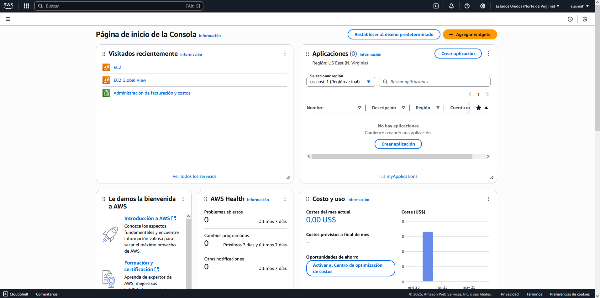

## Creacion de una instancia EC2 en el Free Tier

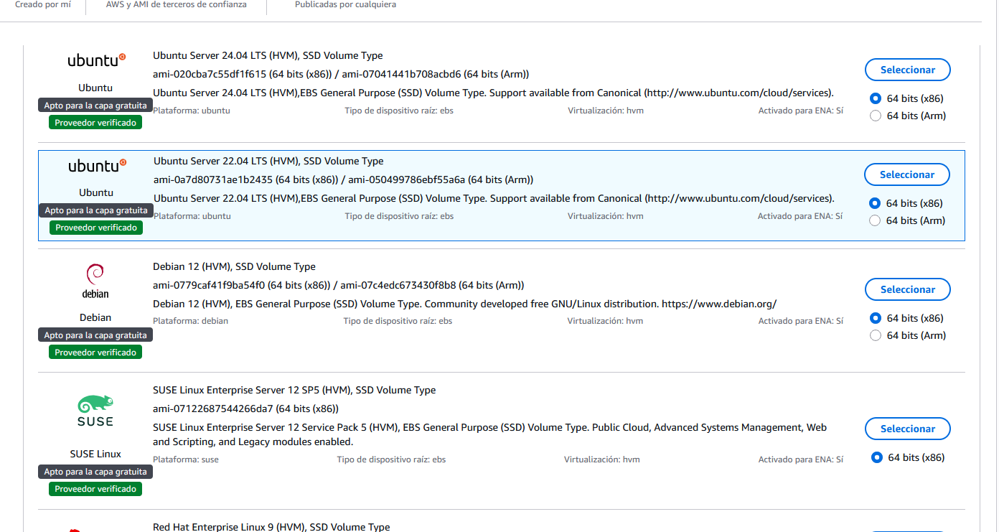
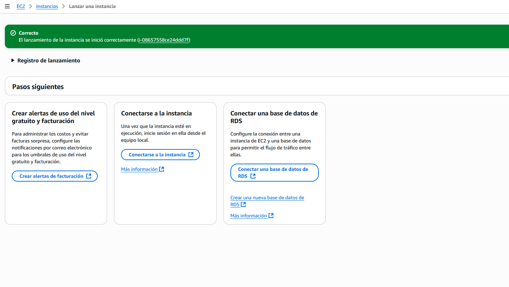

## Conectandose a la instancia con SSH

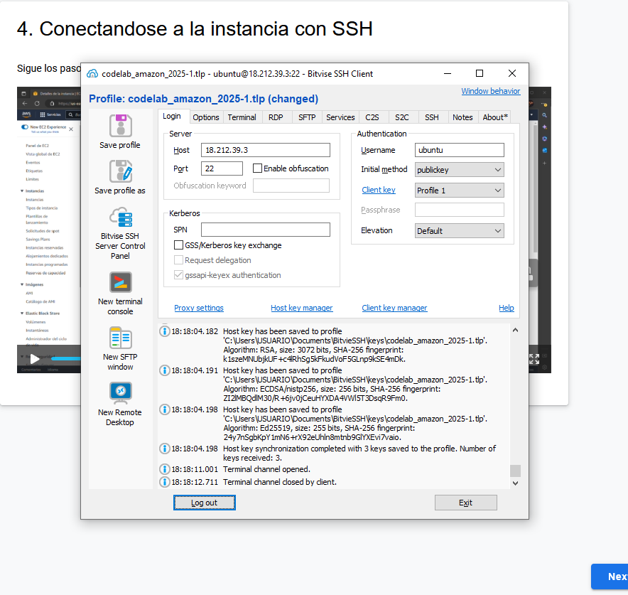
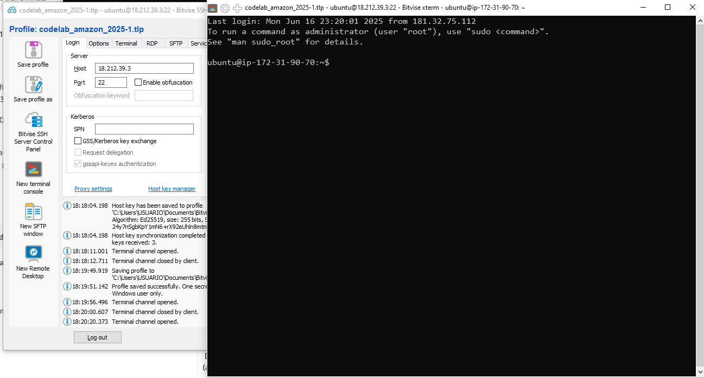

## Instalando NGINX

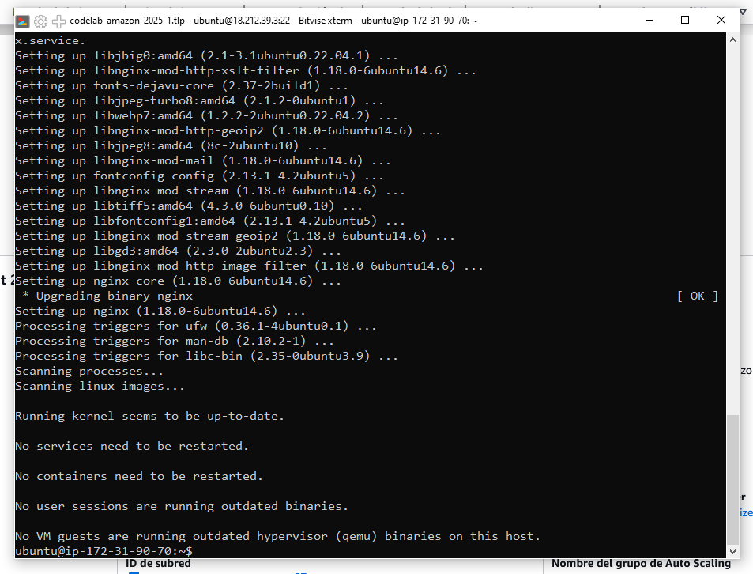

## Instalando Java y Postgresql

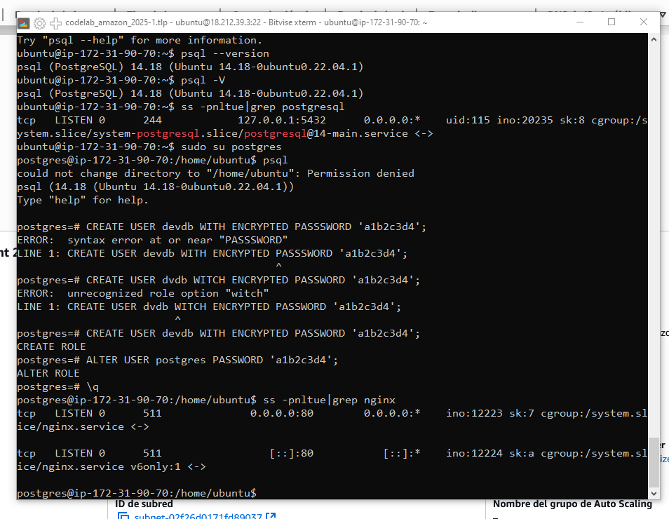

## Apertura del puerto web (80) en la consola de EC2

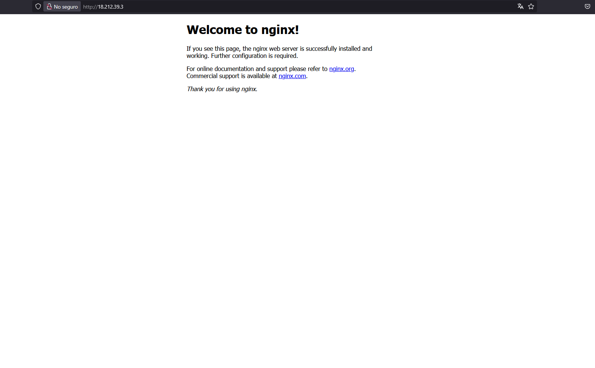

## 9. Creacion de un tunel C2S para pgadmin

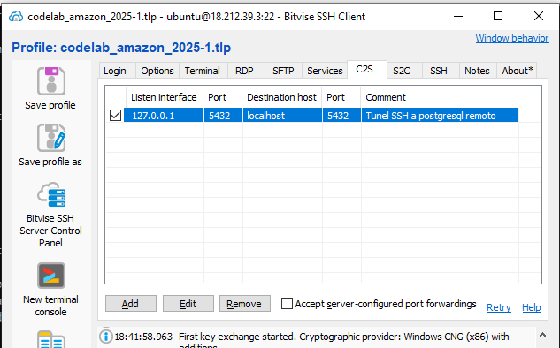

## 10. Configurando pgadmin con postgresql

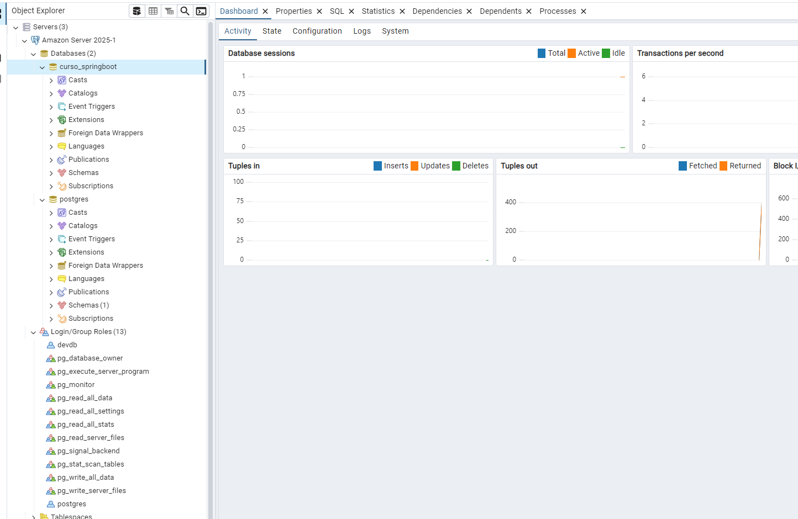

## 11. Creando un par de llaves RSA con passphrase

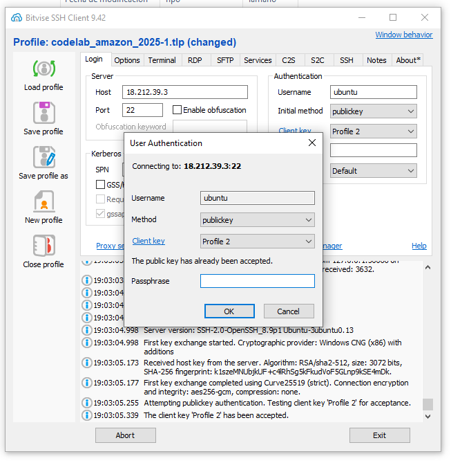
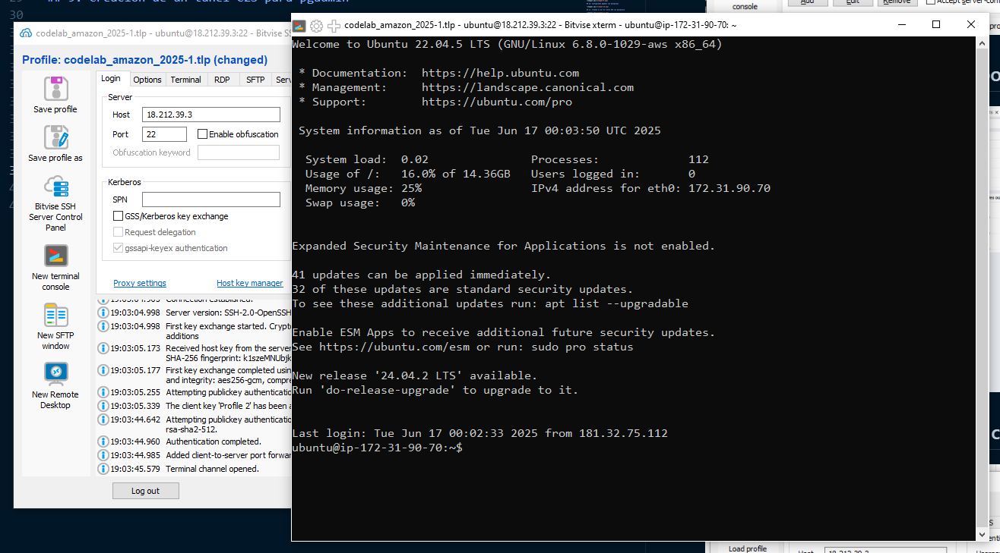
