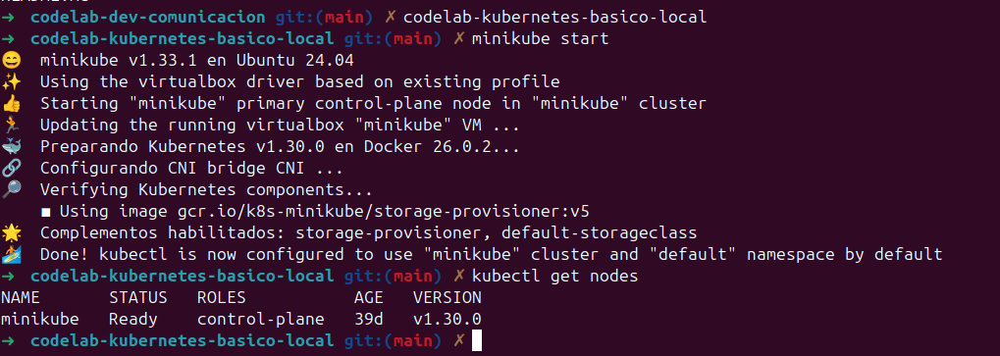
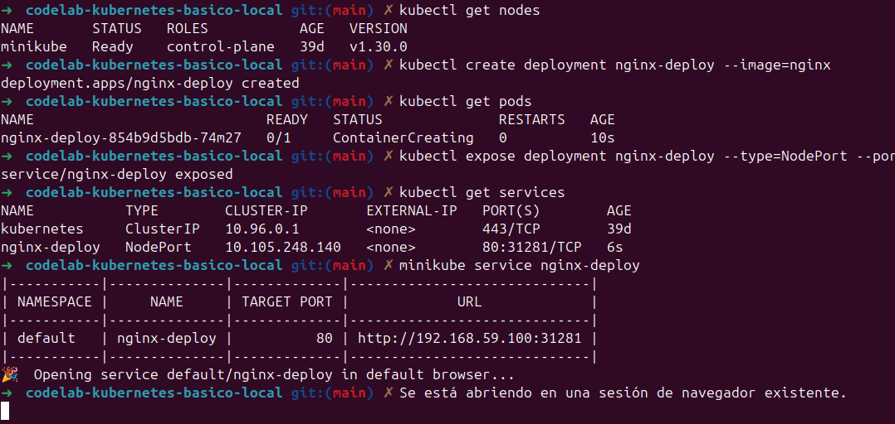
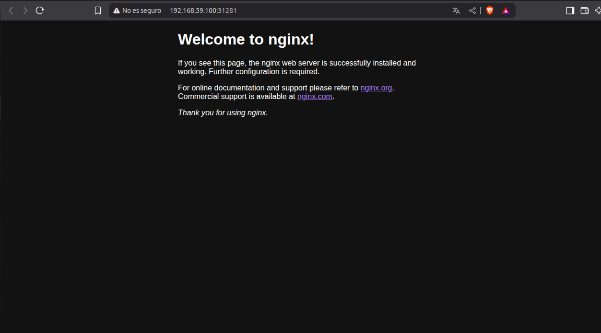
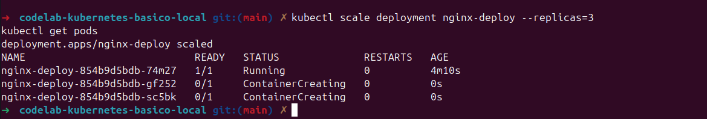
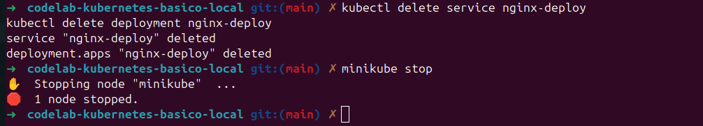

# Introducción práctica a kubernetes (nivel básico)

## Preparar el entorno

## Desplegar tu primera aplicación
### Crear un deployment con nginx

### Acceder desde el navegador

## Escalar la aplicación

## Eliminar todo

