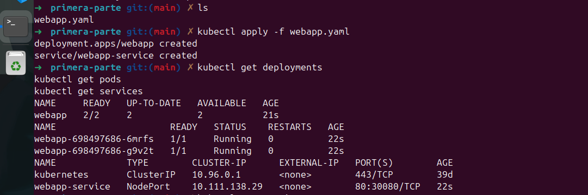
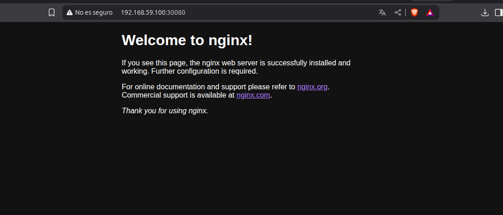
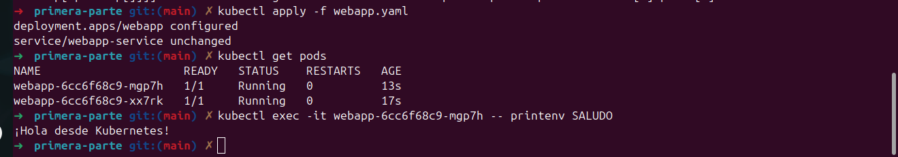
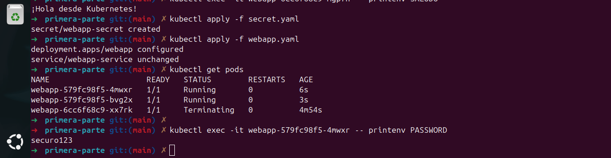
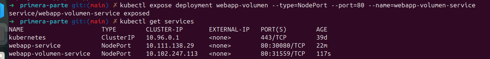
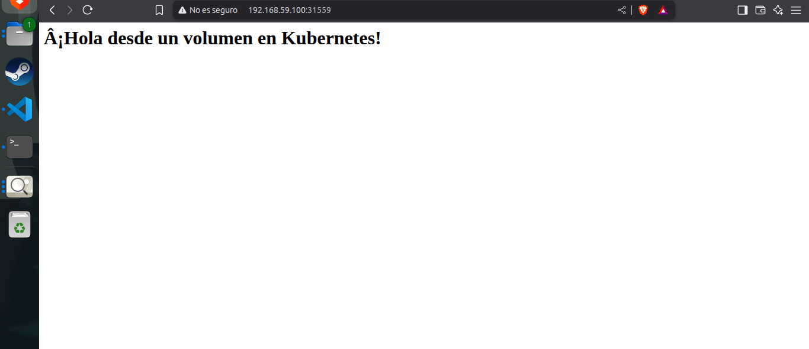
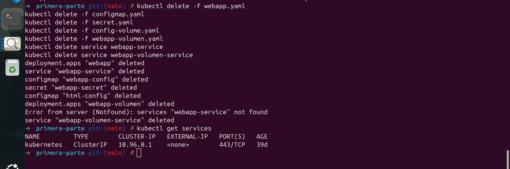

# Primera parte Kubernetes nivel intermedio: configuración declarativa, secrets y volúmenes

## Crear un deployment y un service en YAML

## Externalizar configuraciones con ConfigMap

## Manejar información sensible con Secrets

## Montar archivos como volúmenes (configuración por archivo)

## Limpieza de los recursos

